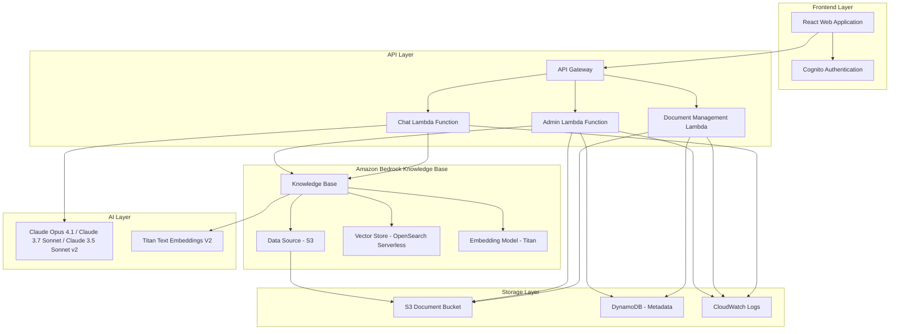

# AI Assistant Design Document - Amazon Bedrock Knowledge Bases Architecture

## Overview

This design document outlines the architecture for an AI-powered software development assistant that leverages Amazon Bedrock Knowledge Bases for document ingestion, vector storage, and retrieval-augmented generation (RAG). The system provides a streamlined approach to knowledge management by utilizing AWS managed services for document processing, embedding generation, and semantic search.

## Architecture

### High-Level Architecture


The architecture diagram above shows the complete system design using Amazon Bedrock Knowledge Bases. The system follows a layered approach:

1. **Frontend Layer**: React web application served via CloudFront with Cognito authentication
2. **API Layer**: API Gateway with WAF protection routing to specialized Lambda functions
3. **Amazon Bedrock Knowledge Base**: Central RAG component with S3 data source and OpenSearch Serverless vector store
4. **Storage & Monitoring**: Document storage, metadata tracking, and comprehensive logging



### Key Architectural Decisions

1. **Amazon Bedrock Knowledge Base**: Central component that handles document ingestion, chunking, embedding generation, and vector storage automatically
2. **S3 as Data Source**: Documents stored in S3 are automatically synchronized with the Knowledge Base
3. **OpenSearch Serverless**: Managed vector database integrated with Knowledge Base for semantic search
4. **Simplified Lambda Functions**: Focus on business logic rather than document processing and embedding generation

## AI Model Selection Strategy

### Claude Model Hierarchy
Based on available models in us-west-2, we implement a fallback strategy for optimal performance:

#### Primary Model: Claude Opus 4.1
- **Model ID**: `anthropic.claude-opus-4-1-20250805-v1:0`
- **Capabilities**: Most advanced reasoning, multimodal (text + image), streaming support
- **Use Case**: Primary model for all chat interactions
- **Context**: Standard context window with excellent reasoning capabilities

#### Fallback Model: Claude 3.7 Sonnet  
- **Model ID**: `anthropic.claude-3-7-sonnet-20250219-v1:0`
- **Capabilities**: Excellent balance of speed and capability, streaming support
- **Use Case**: Fallback when Opus 4.1 is unavailable or rate-limited
- **Context**: Fast responses with high quality reasoning

#### Secondary Fallback: Claude 3.5 Sonnet v2
- **Model ID**: `anthropic.claude-3-5-sonnet-20241022-v2:0`
- **Capabilities**: High performance, multiple context lengths available, streaming support
- **Use Case**: Secondary fallback for high availability
- **Context**: Available in 18k, 51k, 200k, and standard context lengths

### Embedding Model Selection

#### Primary Embedding: Titan Text Embeddings V2
- **Model ID**: `amazon.titan-embed-text-v2:0`
- **Capabilities**: Latest generation, optimized for Knowledge Base integration
- **Dimensions**: 1024 (configurable)
- **Use Case**: All document embedding and semantic search operations

#### Alternative Embedding: Cohere Multilingual v3
- **Model ID**: `cohere.embed-multilingual-v3`
- **Capabilities**: Multilingual support, high-quality embeddings
- **Use Case**: Future enhancement for multilingual document support

### Inference Profiles vs Direct Models

#### Cross-Region Inference Profiles (Recommended)
- **Higher Throughput**: Automatic load balancing across us-east-1, us-east-2, us-west-2
- **Better Availability**: Seamless failover during peak usage or regional issues
- **Usage Tracking**: Built-in CloudWatch metrics and cost allocation
- **Same Pricing**: No additional cost for cross-region routing

**Available Inference Profiles:**
- `us.anthropic.claude-opus-4-1-20250805-v1:0` - Claude Opus 4.1 Cross-Region
- `us.anthropic.claude-3-7-sonnet-20250219-v1:0` - Claude 3.7 Sonnet Cross-Region  
- `us.anthropic.claude-3-5-sonnet-20241022-v2:0` - Claude 3.5 Sonnet v2 Cross-Region

#### Direct Model Invocation (Fallback)
- **Regional Control**: Specific us-west-2 deployment
- **Development**: Testing and debugging scenarios
- **Custom Configuration**: Specific model parameters

### Model Selection Strategy

| Use Case | Recommended Approach | Model Choice | Rationale |
|----------|---------------------|--------------|-----------|
| **Production Chat** | Inference Profile | Opus 4.1 → 3.7 Sonnet → 3.5 Sonnet v2 | High availability, throughput |
| **Complex Analysis** | Inference Profile | Claude Opus 4.1 | Best reasoning, extended thinking |
| **High Volume** | Inference Profile | Claude 3.7 Sonnet | Speed + capability balance |
| **Development** | Direct Model | Any available | Regional control, debugging |
| **Cost Optimization** | Inference Profile | Claude 3.5 Sonnet v2 | Fast, cost-effective |

### Model Selection Strategy & Invocation Methods

#### On-Demand vs Provisioned Throughput Decision Matrix

| Aspect | On-Demand | Provisioned Throughput |
|--------|-----------|----------------------|
| **Cost Model** | Pay-per-token (input/output) | Fixed hourly cost + commitment |
| **Latency** | Variable (shared capacity) | Consistent low latency |
| **Throughput** | Subject to quotas/throttling | Guaranteed capacity (Model Units) |
| **Use Case** | Development, variable workloads | Production, predictable high volume |
| **Commitment** | None | 1-month, 6-month, or no commitment |

#### Model Selection by Use Case

**Claude Opus 4.1** - `anthropic.claude-opus-4-1-20250805-v1:0`
- **Best For**: Complex reasoning, multimodal tasks, highest quality responses
- **Latency**: Moderately fast (slower than Sonnet models)
- **Cost**: Highest ($15/MTok input, $75/MTok output)
- **When to Use**: Critical user queries requiring deep analysis
- **Invocation**: On-demand for development; Provisioned for high-volume production

**Claude 3.7 Sonnet** - `anthropic.claude-3-7-sonnet-20250219-v1:0`
- **Best For**: Balanced performance, extended thinking capabilities
- **Latency**: Fast (optimal speed/quality balance)
- **Cost**: Medium ($3/MTok input, $15/MTok output)
- **When to Use**: Primary production model for most queries
- **Invocation**: On-demand preferred; Provisioned for guaranteed performance

**Claude 3.5 Sonnet v2** - `anthropic.claude-3-5-sonnet-20241022-v2:0`
- **Best For**: High availability fallback, multiple context lengths
- **Latency**: Fast (similar to 3.7 Sonnet)
- **Cost**: Medium ($3/MTok input, $15/MTok output)
- **When to Use**: Fallback when 3.7 Sonnet unavailable
- **Invocation**: On-demand for cost efficiency

#### Dynamic Model Selection with Cost Optimization

```typescript
interface ModelConfig {
  modelArn: string;
  name: string;
  costPerInputToken: number;
  costPerOutputToken: number;
  latencyTier: 'fast' | 'moderate' | 'slow';
  capabilities: string[];
  maxContextLength: number;
}

const MODEL_CONFIGS: ModelConfig[] = [
  {
    modelArn: 'arn:aws:bedrock:us-west-2::foundation-model/anthropic.claude-opus-4-1-20250805-v1:0',
    name: 'Claude Opus 4.1',
    costPerInputToken: 0.000015,  // $15/MTok
    costPerOutputToken: 0.000075, // $75/MTok
    latencyTier: 'moderate',
    capabilities: ['multimodal', 'extended-thinking', 'complex-reasoning'],
    maxContextLength: 200000
  },
  {
    modelArn: 'arn:aws:bedrock:us-west-2::foundation-model/anthropic.claude-3-7-sonnet-20250219-v1:0',
    name: 'Claude 3.7 Sonnet',
    costPerInputToken: 0.000003,  // $3/MTok
    costPerOutputToken: 0.000015, // $15/MTok
    latencyTier: 'fast',
    capabilities: ['extended-thinking', 'balanced-performance'],
    maxContextLength: 200000
  },
  {
    modelArn: 'arn:aws:bedrock:us-west-2::foundation-model/anthropic.claude-3-5-sonnet-20241022-v2:0',
    name: 'Claude 3.5 Sonnet v2',
    costPerInputToken: 0.000003,  // $3/MTok
    costPerOutputToken: 0.000015, // $15/MTok
    latencyTier: 'fast',
    capabilities: ['high-availability', 'multiple-context-lengths'],
    maxContextLength: 200000
  }
];

async function selectOptimalModel(
  queryComplexity: 'simple' | 'moderate' | 'complex',
  requiresMultimodal: boolean = false,
  estimatedTokens: number = 1000
): Promise<ModelConfig> {
  
  // For complex queries or multimodal needs, prefer Opus 4.1
  if (queryComplexity === 'complex' || requiresMultimodal) {
    return MODEL_CONFIGS[0]; // Claude Opus 4.1
  }
  
  // For moderate complexity, use 3.7 Sonnet (best balance)
  if (queryComplexity === 'moderate') {
    return MODEL_CONFIGS[1]; // Claude 3.7 Sonnet
  }
  
  // For simple queries, use most cost-effective option
  return MODEL_CONFIGS[1]; // Claude 3.7 Sonnet (still best value)
}

async function invokeWithFallback(
  selectedModel: ModelConfig,
  prompt: string,
  useProvisioned: boolean = false
): Promise<any> {
  const modelConfigs = [selectedModel, ...MODEL_CONFIGS.filter(m => m !== selectedModel)];
  
  for (const config of modelConfigs) {
    try {
      const modelId = useProvisioned 
        ? process.env[`${config.name.replace(/\s+/g, '_').toUpperCase()}_PROVISIONED_ARN`]
        : config.modelArn;
        
      return await bedrockRuntime.invokeModel({
        modelId: modelId || config.modelArn,
        body: JSON.stringify({
          anthropic_version: "bedrock-2023-05-31",
          max_tokens: 4000,
          messages: [{ role: 'user', content: prompt }]
        })
      }).promise();
      
    } catch (error) {
      console.log(`Model ${config.name} failed, trying next...`, error.message);
      continue;
    }
  }
  
  throw new Error('All Claude models unavailable');
}
```

#### Production Deployment Strategy

**Development Environment**
- Use On-Demand invocation for all models
- Implement cost tracking and monitoring
- Test model performance characteristics

**Staging Environment**
- Use On-Demand with production-like load testing
- Measure actual token usage and costs
- Validate fallback mechanisms

**Production Environment**
- **Primary**: Claude 3.7 Sonnet with Provisioned Throughput (1-month commitment)
- **Fallback**: Claude 3.5 Sonnet v2 On-Demand
- **Premium**: Claude Opus 4.1 On-Demand for complex queries
- **Cost Control**: Implement query classification to route appropriately

## Components and Interfaces

### 1. Frontend Components

#### React Web Application
- **Authentication**: Cognito-integrated login/logout
- **Chat Interface**: Real-time conversation with AI assistant
- **Document Management**: Upload and view documents
- **Admin Panel**: Knowledge base management for administrators

#### Key Frontend Features
- Responsive design for desktop and tablet
- Real-time chat interface with typing indicators
- Drag-and-drop document upload
- Document status tracking
- Role-based UI components

### 2. API Gateway and Lambda Functions

#### Chat Lambda Function
```typescript
interface ChatRequest {
  question: string;
  conversationId?: string;
  userId: string;
}

interface ChatResponse {
  answer: string;
  sources: DocumentSource[];
  conversationId: string;
  timestamp: string;
}
```

**Responsibilities:**
- Query Amazon Bedrock Knowledge Base using RetrieveAndGenerate API
- Manage conversation context
- Format responses with source citations
- Handle error scenarios gracefully

#### Document Management Lambda
```typescript
interface DocumentUploadRequest {
  fileName: string;
  fileContent: Buffer;
  contentType: string;
  userId: string;
}

interface DocumentMetadata {
  documentId: string;
  fileName: string;
  uploadedBy: string;
  uploadDate: string;
  status: 'uploading' | 'processing' | 'ready' | 'failed';
  knowledgeBaseStatus: 'pending' | 'synced' | 'failed';
}
```

**Responsibilities:**
- Upload documents to S3 bucket (Knowledge Base data source)
- Store document metadata in DynamoDB
- Trigger Knowledge Base synchronization
- Monitor document processing status

#### Admin Lambda Function
```typescript
interface KnowledgeBaseManagement {
  syncDataSource(): Promise<SyncStatus>;
  getIngestionJobs(): Promise<IngestionJob[]>;
  deleteDocument(documentId: string): Promise<void>;
  getKnowledgeBaseMetrics(): Promise<Metrics>;
}
```

**Responsibilities:**
- Manage Knowledge Base data source synchronization
- Monitor ingestion job status
- Provide administrative controls
- Generate usage analytics

### 3. Amazon Bedrock Knowledge Base Integration

#### Knowledge Base Configuration
```yaml
KnowledgeBase:
  Name: "AI-Assistant-KB"
  Description: "Software development team knowledge base"
  RoleArn: "arn:aws:iam::account:role/BedrockKBRole"
  
DataSource:
  Name: "Documents-S3-Source"
  DataSourceConfiguration:
    Type: "S3"
    S3Configuration:
      BucketArn: "arn:aws:s3:::ai-assistant-documents"
      InclusionPrefixes: ["documents/"]
  
VectorIngestionConfiguration:
  ChunkingConfiguration:
    ChunkingStrategy: "FIXED_SIZE"
    FixedSizeChunkingConfiguration:
      MaxTokens: 300
      OverlapPercentage: 20
      
EmbeddingModelArn: "arn:aws:bedrock:us-west-2::foundation-model/amazon.titan-embed-text-v2:0"

VectorKnowledgeBaseConfiguration:
  EmbeddingModelArn: "arn:aws:bedrock:us-west-2::foundation-model/amazon.titan-embed-text-v2:0"
  EmbeddingModelConfiguration:
    BedrockEmbeddingModelConfiguration:
      Dimensions: 1536
```

#### RetrieveAndGenerate API Usage
```typescript
const retrieveAndGenerateParams = {
  input: {
    text: userQuestion
  },
  retrieveAndGenerateConfiguration: {
    type: 'KNOWLEDGE_BASE',
    knowledgeBaseConfiguration: {
      knowledgeBaseId: process.env.KNOWLEDGE_BASE_ID,
      modelArn: 'arn:aws:bedrock:us-west-2::foundation-model/anthropic.claude-opus-4-1-20250805-v1:0', // Fallback order: Opus 4.1 -> 3.7 Sonnet -> 3.5 Sonnet v2
      retrievalConfiguration: {
        vectorSearchConfiguration: {
          numberOfResults: 5,
          overrideSearchType: 'HYBRID'
        }
      }
    }
  }
};
```

## Data Models

### 1. Document Metadata (DynamoDB)

```typescript
interface DocumentRecord {
  PK: string; // "DOC#${documentId}"
  SK: string; // "METADATA"
  documentId: string;
  fileName: string;
  originalName: string;
  contentType: string;
  fileSize: number;
  uploadedBy: string;
  uploadDate: string;
  s3Key: string;
  s3Bucket: string;
  status: DocumentStatus;
  knowledgeBaseStatus: KnowledgeBaseStatus;
  processingErrors?: string[];
  lastSyncDate?: string;
  GSI1PK: string; // "USER#${userId}"
  GSI1SK: string; // "DOC#${uploadDate}"
}

type DocumentStatus = 'uploading' | 'uploaded' | 'processing' | 'ready' | 'failed';
type KnowledgeBaseStatus = 'pending' | 'ingesting' | 'synced' | 'failed';
```

### 2. User Management (Cognito)

```typescript
interface CognitoUser {
  sub: string; // User ID
  email: string;
  'custom:role': 'admin' | 'user';
  'custom:department'?: string;
  email_verified: boolean;
  cognito:username: string;
}
```

### 3. Conversation Context

```typescript
interface ConversationContext {
  conversationId: string;
  userId: string;
  messages: ConversationMessage[];
  createdAt: string;
  lastActivity: string;
}

interface ConversationMessage {
  messageId: string;
  type: 'user' | 'assistant';
  content: string;
  timestamp: string;
  sources?: DocumentSource[];
}

interface DocumentSource {
  documentId: string;
  fileName: string;
  excerpt: string;
  confidence: number;
  s3Location: string;
}
```

## Error Handling

### 1. Knowledge Base Error Scenarios

```typescript
enum KnowledgeBaseErrorType {
  KNOWLEDGE_BASE_NOT_FOUND = 'KNOWLEDGE_BASE_NOT_FOUND',
  RETRIEVAL_FAILED = 'RETRIEVAL_FAILED',
  GENERATION_FAILED = 'GENERATION_FAILED',
  INSUFFICIENT_CONTEXT = 'INSUFFICIENT_CONTEXT',
  RATE_LIMIT_EXCEEDED = 'RATE_LIMIT_EXCEEDED'
}

interface ErrorResponse {
  error: {
    code: KnowledgeBaseErrorType;
    message: string;
    requestId: string;
    timestamp: string;
  };
  fallbackResponse?: string;
}
```

### 2. Document Processing Error Handling

```typescript
interface DocumentProcessingError {
  documentId: string;
  errorType: 'UPLOAD_FAILED' | 'SYNC_FAILED' | 'INGESTION_FAILED';
  errorMessage: string;
  retryCount: number;
  lastRetryDate: string;
  canRetry: boolean;
}
```

### 3. Graceful Degradation

- **Knowledge Base Unavailable**: Provide cached responses or direct users to document library
- **Document Processing Delays**: Show processing status and estimated completion time
- **Rate Limiting**: Implement exponential backoff and user-friendly messaging
- **Partial Results**: Display available information with disclaimers about incomplete data

## Testing Strategy

### Test-Driven Development Approach
All development follows the Red-Green-Refactor TDD cycle with real AWS infrastructure testing.

### 1. Knowledge Base Integration Testing (TDD)

```typescript
// RED: Write failing tests first
describe('Knowledge Base Integration', () => {
  test('should retrieve relevant documents for user questions', async () => {
    // Test against real deployed Knowledge Base
    const response = await handleChatQuery('What is AWS Lambda?');
    expect(response.answer).toBeDefined();
    expect(response.sources).toHaveLength.greaterThan(0);
    expect(response.sources[0].documentId).toBeDefined();
  });
  
  test('should handle document ingestion workflow', async () => {
    // Test complete pipeline: S3 upload -> Knowledge Base sync -> Query availability
    const uploadResult = await uploadDocument(testPDF, 'test-user');
    await waitForKnowledgeBaseIngestion(uploadResult.documentId);
    
    const queryResult = await handleChatQuery('What does the test document contain?');
    expect(queryResult.sources.some(s => s.documentId === uploadResult.documentId)).toBe(true);
  });
  
  test('should provide source citations in responses', async () => {
    // Verify response includes document sources and excerpts from real Knowledge Base
    const response = await handleChatQuery('Explain the testing strategy');
    expect(response.sources).toBeArray();
    expect(response.sources[0].excerpt).toBeDefined();
    expect(response.sources[0].confidence).toBeGreaterThan(0);
  });
});

// GREEN: Implement minimal functionality to pass tests
// REFACTOR: Optimize while maintaining test coverage
```

### 2. End-to-End Testing with Playwright MCP (TDD)

```typescript
// RED: Write failing E2E tests first
describe('Document Upload and Query Workflow', () => {
  test('should complete full TDD workflow: upload → ingest → query → response', async () => {
    // Navigate to deployed application (real CloudFront URL)
    await mcp_playwright_browser_navigate({ 
      url: 'https://deployed-cloudfront-url.com' 
    });
    
    // RED: Test document upload functionality
    await mcp_playwright_browser_file_upload({ 
      paths: ['/path/to/test-document.pdf'] 
    });
    
    // Wait for Knowledge Base ingestion (real AWS processing time)
    await mcp_playwright_browser_wait_for({ time: 180 });
    
    // RED: Test chat functionality with uploaded document
    await mcp_playwright_browser_type({
      element: 'chat input',
      ref: 'chat-input-field',
      text: 'What does the uploaded document say about testing?'
    });
    
    await mcp_playwright_browser_click({
      element: 'send button',
      ref: 'send-button'
    });
    
    // Verify real response from deployed Knowledge Base
    const response = await mcp_playwright_browser_snapshot();
    // Assert response contains relevant information and source references from real AWS services
  });
  
  test('should handle Knowledge Base ingestion failures gracefully', async () => {
    // Test error scenarios with real AWS services
    // Upload invalid document and verify error handling
  });
});

// GREEN: Implement UI components to pass E2E tests
// REFACTOR: Optimize user experience while maintaining test coverage
```

### 3. AWS Infrastructure Testing

- **Terraform Validation**: Use Terraform MCP server for infrastructure validation
- **Security Scanning**: Use Checkov MCP server for security compliance
- **Performance Testing**: Load testing against deployed Knowledge Base endpoints

## Security Considerations

### 1. Authentication and Authorization

- **Cognito Integration**: Secure user authentication with JWT tokens
- **Role-Based Access**: Admin vs. user permissions for document management
- **API Gateway Authorization**: Lambda authorizer for API endpoint protection

### 2. Data Protection

- **S3 Encryption**: Server-side encryption for document storage
- **Knowledge Base Security**: IAM roles with least privilege access
- **Data Isolation**: User-based document access controls

### 3. Compliance

- **Data Retention**: Configurable document retention policies
- **Audit Logging**: CloudWatch logs for all user actions
- **Privacy Controls**: User data deletion capabilities

## Deployment Architecture

### 1. Infrastructure as Code (Terraform)

```hcl
# Knowledge Base Resources
resource "aws_bedrockagent_knowledge_base" "ai_assistant" {
  name        = "ai-assistant-knowledge-base"
  description = "AI Assistant Knowledge Base for development team"
  role_arn    = aws_iam_role.bedrock_kb_role.arn
  
  knowledge_base_configuration {
    vector_knowledge_base_configuration {
      embedding_model_arn = "arn:aws:bedrock:us-west-2::foundation-model/amazon.titan-embed-text-v1"
    }
  }
  
  storage_configuration {
    opensearch_serverless_configuration {
      collection_arn    = aws_opensearchserverless_collection.kb_collection.arn
      vector_index_name = "ai-assistant-index"
      
      field_mapping {
        vector_field   = "vector"
        text_field     = "text"
        metadata_field = "metadata"
      }
    }
  }
}

resource "aws_bedrockagent_data_source" "s3_source" {
  knowledge_base_id = aws_bedrockagent_knowledge_base.ai_assistant.id
  name              = "s3-documents-source"
  
  data_source_configuration {
    type = "S3"
    s3_configuration {
      bucket_arn = aws_s3_bucket.documents.arn
      inclusion_prefixes = ["documents/"]
    }
  }
  
  vector_ingestion_configuration {
    chunking_configuration {
      chunking_strategy = "FIXED_SIZE"
      fixed_size_chunking_configuration {
        max_tokens         = 300
        overlap_percentage = 20
      }
    }
  }
}
```

### 2. Environment Configuration

- **Development**: Single Knowledge Base with test documents
- **Staging**: Production-like setup with sample data
- **Production**: Full Knowledge Base with monitoring and backup

### 3. Monitoring and Observability

- **CloudWatch Metrics**: Knowledge Base query performance and success rates
- **Custom Dashboards**: Document processing status and user activity
- **Alerting**: Failed ingestion jobs and API errors

## Performance Optimization

### 1. Knowledge Base Configuration

- **Chunking Strategy**: Optimized chunk size (300 tokens) with 20% overlap for better context retention
- **Retrieval Configuration**: Hybrid search combining semantic and keyword matching for improved accuracy
- **Result Filtering**: Limit to top 5 most relevant documents to balance quality and performance
- **Ingestion Monitoring**: Track ingestion job status and handle failures gracefully

### 2. Caching Strategy

- **API Gateway Caching**: Cache frequent queries for improved response time
- **Lambda Memory Optimization**: Right-size Lambda functions (1024MB recommended for Bedrock calls)
- **Connection Pooling**: Reuse Bedrock client connections across invocations
- **Response Caching**: Cache Knowledge Base responses for identical queries

### 3. Scalability Considerations

- **Auto-scaling**: Lambda concurrency limits and API Gateway throttling
- **Knowledge Base Limits**: Monitor document count (up to 10,000 documents per KB) and query volume
- **Cost Optimization**: Efficient chunking and retrieval strategies to minimize token usage
- **OpenSearch Serverless**: Minimum 4 OCU billing consideration for cost planning

This architecture leverages Amazon Bedrock Knowledge Bases to provide a robust, scalable, and maintainable AI assistant system with minimal custom code for document processing and vector operations.