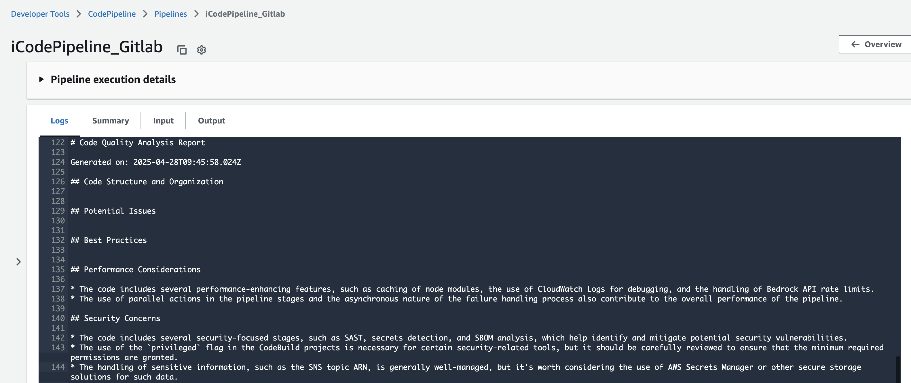
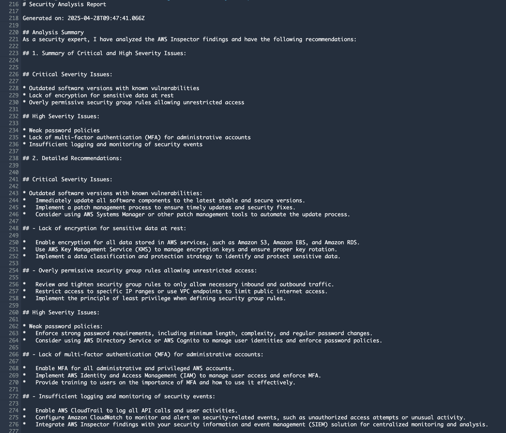
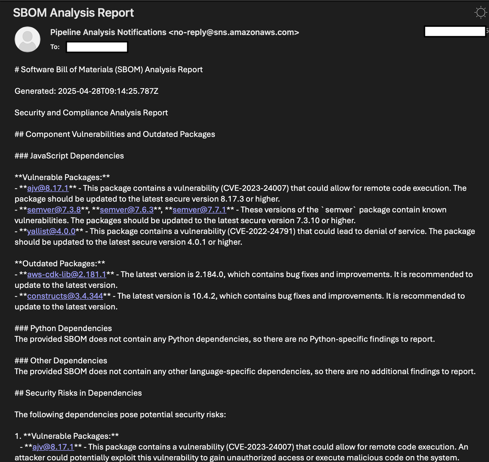
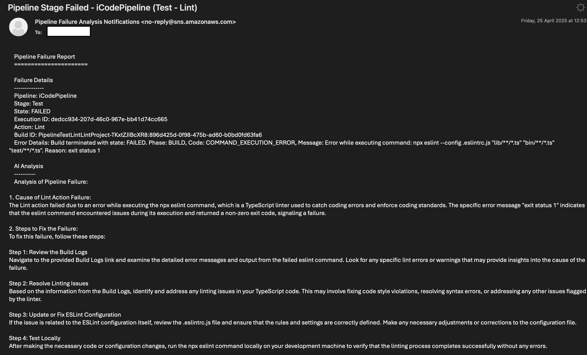

# AI-Enhanced DevSecOps Pipeline with AWS Bedrock Integration

## 1. Introduction

AnyCompanyReads, a global book retailer with physical stores, aims to modernize their business by launching a secure e-commerce platform. The product owner has collaborated with business stakeholders, security teams, and DevOps engineers to establish a secure-by-design approach for their online bookstore. This initiative requires implementing a robust DevSecOps pipeline that integrates security at every stage of development.

Let's explore how we can leverage Amazon Bedrock's Generative AI capabilities to build and maintain a secure, scalable online bookstore. This pattern demonstrates how to enhance your DevSecOps pipeline by integrating generative AI capabilities using Amazon Bedrock. The solution demonstrates how to automatically analyze code, detect security vulnerabilities, generate test cases, improve code quality etc.,. throughout your CI/CD workflow using AWS CodePipeline. This implementation utilizes Amazon Bedrock for Code Quality Analysis (with Claude) and Security Scan (with Inspector2 & Claude). This solution uses the following AWS services:

* AWS CodeBuild 
* AWS CodePipeline
* Amazon Inspector
* Amazon Bedrock for AI-powered assistance and automation
* AWS CloudWatch
* AWS IAM


## 2. Solution Architecture


A comprehensive DevSecOps pipeline implementation that leverages AWS Bedrock for intelligent security analysis, code quality assessment, and automated failure handling. This solution enhances traditional CI/CD pipelines with AI-powered insights and automated security controls.

The pipeline integrates multiple security and quality gates including SAST analysis, secrets detection, SBOM generation, and security scanning with real-time AI analysis of findings. It provides automated failure analysis and intelligent notifications to help teams quickly identify and resolve issues. The solution uses AWS CDK for infrastructure as code and implements best practices for secure software delivery.

* **Development Initialization** - 
  * Developers use AWS CDK for infrastructure as code(IaC). 
  * Amazon Q Developer can be used as part of Local development as it provides real-time secure coding assistance and best practices.

* **Security Scanning & Quality Analysis** -  Amazon Bedrock assists in analyzing security patterns and providing remediation suggestions. In this pattern we have integrated Bedrock analysis in below stages(as an example), but can be integrated in other cnfigured stages as well.
  * Code quality analysis
  * Security scan
  * Software Bill of Materials (SBOM) generation

* **Testing & Validation** - 
  * Automated Integration tests with AI-assisted test case generation
  * Code linting for consistency and security best practices

* **Deployment Controls** - Amazon Bedrock helps validate the deployment and changes to take the decision to proceed or not-to-proceed with Deployment.
  * Deployment analysis for infrastructure security
  * Manual approval gates for critical environment promotions

## 3. Repository Structure
```
deployment/pattern-deploy-devsecops-bedrock/
└── cdk/                              # CDK application root
    ├── bin/                          # CDK entry point
    │   └── cdk-pipeline.ts           # Main pipeline definition
    ├── lib/                          # Core implementation
    │   ├── configs/                  # Pipeline configuration
    │   ├── constructs/              
    │   │   └── pipeline/             # Pipeline components
    │   │       ├── failure-handling/ # Failure analysis and notifications
    │   │       ├── monitoring/       # Pipeline metrics and alarms
    │   │       ├── projects/         # Build/test/security projects
    │   │       └── stages/          # Pipeline stage definitions
    │   └── stacks/                   # CDK stack definitions
    ├── test/                         # Test files
    └── cdk.json                      # CDK configuration
```

This section outlines the CDK project structure for the DevSecOps pipeline implementation:
- The root directory contains the core CDK application code
- bin: contains the entry point file that defines the main pipeline
- lib: contains the core implementation code organized into:
  - configs: for pipeline configuration settings
  - constructs/pipeline: for modular pipeline components including:
    - failure-handling: for automated failure analysis
    - monitoring: for pipeline metrics and CloudWatch alarms
    - projects: CodeBuild projects for various stages defined
    - stages: Various stages part of the Code Pipeline
  - stacks: contains the CDK stack definitions
- test: contains test files for the CDK code

In this pattern we have 2 CDK stacks
1. **CdkPipelineStack** - To deploy the AWS CodePipeline with all the stages, CodeBuild projects and AWS Bedrock integration code.
2. **MyApplicationStack** - An example application which is deployed via the final stage of this DevSecOps pipeline.

## 4. Prerequisites
- Node.js 18.x or later
- AWS CDK CLI v2.181.1 or later
- AWS CLI v2 configured with appropriate credentials
- AWS Account with permissions to create:
  - CodePipeline
  - CodeBuild projects
  - Lambda functions
  - CloudWatch resources
  - IAM roles
  - SNS topics
  - Bedrock model
- A [Gitlab repository](https://docs.gitlab.com/user/project/repository/)
- An [AWS Connection to Gitlab](https://docs.aws.amazon.com/dtconsole/latest/userguide/connections-create-gitlab.html)
  
### In AWS console:
* [Create an AWS account](https://portal.aws.amazon.com/gp/aws/developer/registration/index.html) if you do not already have one and log in. The IAM user that you use must have sufficient permissions to make necessary AWS service calls and manage AWS resources.
*  Follow the steps below to [configure IAM Identity Center] (https://docs.aws.amazon.com/singlesignon/latest/userguide/what-is.html) for connecting your workforce users to AWS managed applications such as Amazon Q and other AWS resources. 
    * [Enable AWS IAM Identity Center](https://docs.aws.amazon.com/singlesignon/latest/userguide/enable-identity-center.html).
    * [Create a new user to your IAM Identity Center](https://docs.aws.amazon.com/singlesignon/latest/userguide/addusers.html). Make a note of the 
    [Amazon Resource Name (ARN)](https://docs.aws.amazon.com/IAM/latest/UserGuide/reference_identifiers.html#identifiers-arns) associated with the IAM Identity Center.

### In your local terminal:
* [Install npm](https://docs.npmjs.com/downloading-and-installing-node-js-and-npm): The deployment will be done using AWS Cloud Deployment Kit (AWS CDK)](https://aws.amazon.com/cdk/). Therefore, install the Node Package Manager to install the CDK CLI.
* [AWS Cloud Development Kit (AWS CDK)](https://docs.aws.amazon.com/cdk/v2/guide/getting_started.html): Use the Node Package Manager to install the CDK CLI.

## 5. Deployment Instructions
1. Clone the repository:
    ```bash
    git clone <repository-url>
    cd deployment/pattern-deploy-devsecops-bedrock/cdk
    ```

2. Install dependencies:
    ```bash
    npm install
    ```

3. Bootstrap CDK (if not already done): Before you deploy the stack into the AWS environment, the environment must first be bootstrapped. Run the following command to bootstrap  your AWS environment for usage with the AWS Cloud Development Kit (AWS CDK).
    ```bash
    cdk bootstrap
    ```

4. Configure below values in the pipeline settings file `lib/configs/pipeline-config.ts`:
    - Gitlab source details
      - `source` is the Gitlab repo which contains this CDK code for the AWS CodePipeline
      - `source_app_code` is the Gitlab repo where your Application code resides
    - Name for the AWS CodePipeline
    - Email ID for pipeline related notifications and Bedrock analysis reports

      ```typescript
      export const PipelineConfig = {
        source: {
          connectionArn: 'your_connection_arn',
          repositoryOwner: 'gitlab_org_name',    // Organization/owner name
          repositoryName: 'gitlab_repo_name',      // Repository name
          branchName: 'main',
          type: 'GITLAB'  // Optional: to identify source type
        },
        source_app_code: {
          connectionArn: 'your_connection_arn',
          repositoryOwner: 'gitlab_org_name',    // Organization/owner name
          repositoryName: 'gitlab_repo_name',      // Repository name
          branchName: 'main',
          type: 'GITLAB'  // Optional: to identify source type
        },
        pipeline: {
          name: 'iCodePipeline_Gitlab',
        },
        notification: {
          email: 'your-email@example.com'
        },
      };      ```

5. Once the above changes are done, commit and push the code into [your Gitlab repository](#4-prerequisites)
    > **_NOTE:_** Make sure you use the `main` branch or the  branch mentioned in the `lib/configs/pipeline-config.ts` file

6. Run the following command to deploy the CDK Pipeline stack named `CdkPipelineStack`.
    ```bash
    cdk deploy CdkPipelineStack
    ```

7. You can now view the CDK stack that is deployed at [AWS CloudFormation](https://console.aws.amazon.com/cloudformation/home).

    

8. You should now be able to see the DevSecOps pipeline at [AWS CodePipeline](https://us-east-1.console.aws.amazon.com/codesuite/codepipeline/pipelines?region=us-east-1)

    

## 6. Pipeline Features

### AI-Powered Analysis Scripts
The pipeline includes several Bedrock-powered analysis scripts located in `cdk/scripts/`:

- **analyze-code-quality.js** - Analyzes code quality metrics and provides improvement suggestions
- **analyze-deployment.js** - Evaluates deployment readiness and infrastructure security
- **analyze-failure.js** - Provides intelligent failure analysis and remediation steps
- **analyze-sast.js** - Processes SAST scan results with AI-powered insights
- **analyze-sbom.js** - Generates comprehensive Software Bill of Materials analysis
- **analyze-test-results.ts** - Analyzes test coverage and suggests improvements
- **generate-integration-tests.ts** - Auto-generates integration test cases
- **process-security-findings.js** - Processes and prioritizes security vulnerabilities

### Pipeline Stages
1. **Source** - GitLab repository integration
2. **Build** - Code compilation and dependency management
3. **Code Quality Analysis** - AI-powered code review and quality assessment
4. **Security Scan** - SAST analysis with Bedrock insights
5. **Test** - Automated testing with AI-generated test cases
6. **SBOM Generation** - Software Bill of Materials creation and analysis
7. **Deployment Analysis** - Infrastructure security validation
8. **Deploy** - Automated deployment with approval gates

### Monitoring and Notifications
- Real-time pipeline monitoring via CloudWatch
- Email notifications for pipeline events
- AI-generated failure analysis reports
- Security findings prioritization and remediation guidance

## 7. Configuration Management

### Pipeline Configuration
Update `lib/configs/pipeline-config.ts` to customize:
- Source repository settings
- Pipeline naming conventions
- Notification preferences
- Bedrock model selection
- Security scan parameters

## 8. Troubleshooting

### Common Issues

1. **Pipeline Failure Analysis**
   - Issue: Pipeline fails with unclear error messages
   - Solution: Check CloudWatch Log Group `/aws/events/pipeline-failure-debug-*`
   - AI failure analysis sent to configured notification email
   - Review generated analysis in CodeBuild logs

2. **Bedrock Integration Issues**
   - Issue: Bedrock API calls failing
   - Ensure CodeBuild role has `bedrock:InvokeModel` permissions
   - Verify AWS region supports Bedrock
   - Check model availability in your region

3. **Bedrock Throttle Errors**
   - Issue: `ThrottlingException: Too many tokens, please wait before trying again`
   - Ensure sufficient [Service Quota](https://us-east-1.console.aws.amazon.com/servicequotas/home?region=us-east-1) for Bedrock
   - Pattern uses `anthropic.claude-3-haiku` by default
   - Request quota increase or switch to available model

4. **CDK Deployment Issues**
   - Issue: CDK bootstrap failures
   - Ensure AWS CLI is configured with proper permissions
   - Verify CDK version compatibility (v2.181.1+)
   - Check region-specific resource limits

### Debug Commands
```bash
# Check CDK stack status
cdk list
cdk diff CdkPipelineStack

# View CloudFormation events
aws cloudformation describe-stack-events --stack-name CdkPipelineStack

# Check CodeBuild logs
aws logs describe-log-groups --log-group-name-prefix "/aws/codebuild/"
```

## 9. Sample AI-Generated Reports
### 1. Code Quality
  

### 2. Security Scan
  

### 3. SBOM report generation
  

### 4. Deployment Analysis
  

### 5. Pipeline failure analysis
  

## 11. Customization

### Adding New Analysis Scripts
1. Create script in `cdk/scripts/`
2. Update CodeBuild project configuration
3. Add to pipeline stage definition
4. Configure Bedrock model permissions

### Extending Security Scans
- Modify `analyze-sast.js` for custom security rules
- Update `process-security-findings.js` for custom prioritization
- Configure additional security tools in CodeBuild

### Custom Notifications
- Update notification templates in constructs
- Add new notification channels (Slack, Teams)
- Configure custom email templates

## 12. Best Practices

- **Security**: Enable all security scans and review findings regularly
- **Cost Optimization**: Monitor Bedrock usage and optimize model calls
- **Performance**: Use appropriate Bedrock models for different analysis types
- **Monitoring**: Set up CloudWatch alarms for pipeline failures
- **Documentation**: Keep pipeline configuration documented and version controlled

## 13. Security

See [CONTRIBUTING](CONTRIBUTING.md#security-issue-notifications) for more information.

## 14. License

This library is licensed under the MIT-0 License. See the LICENSE file.

## 15. Disclaimer

The solution architecture sample code is provided without any guarantees, and you're not recommended to use it for production-grade workloads. The intention is to provide content to build and learn. Be sure of reading the licensing terms.